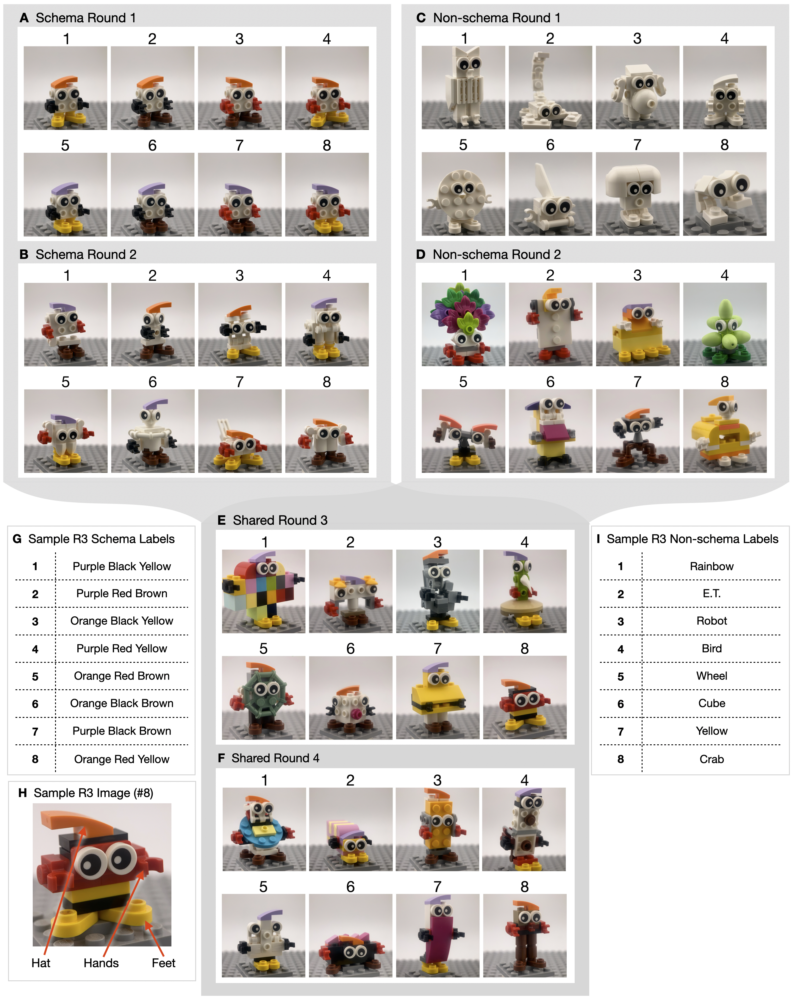
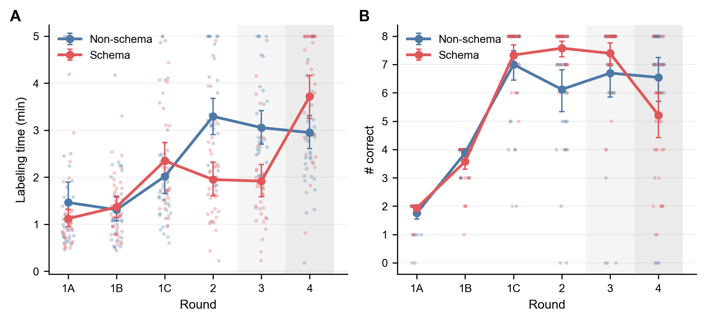
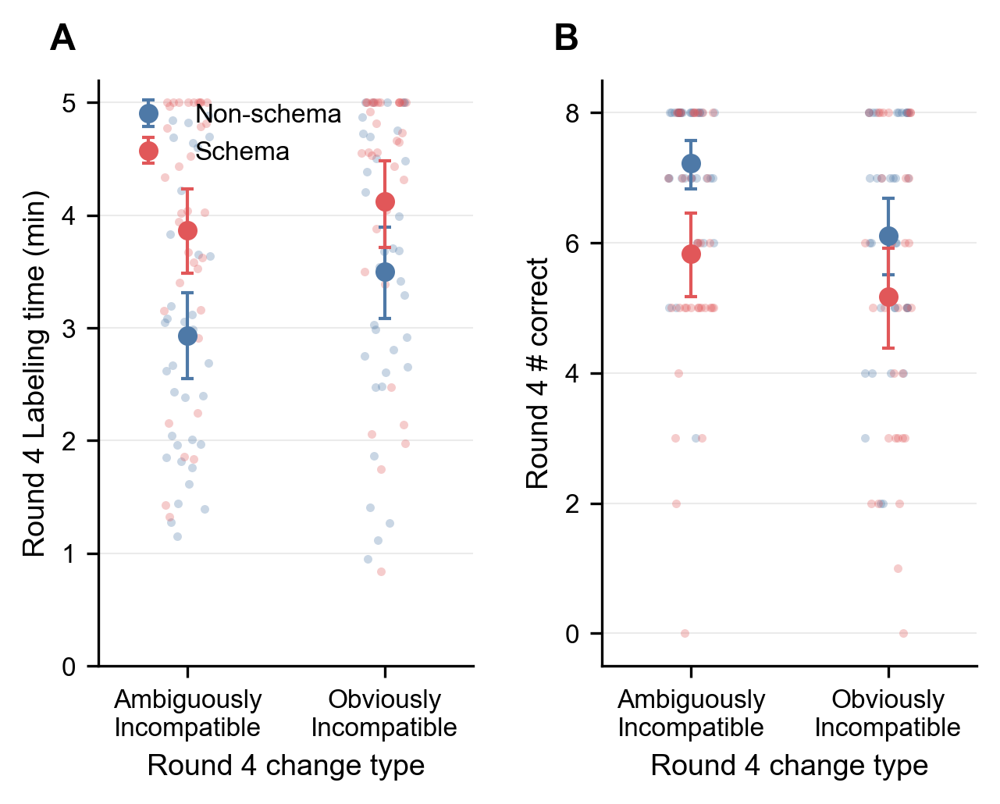

# Seeing Like an Organization

**An experimental paradigm for how shared cognitive schemas enable — and trap —
organizational adaptation.**

This repository holds the experiment definitions, anonymized data, and analysis
code behind the paper *"Seeing Like an Organization: An Experimental Paradigm for
Analyzing how Shared Cognitive Schemas Enable and Trap"* (Volvovsky, Houghton &
Zuckerman Sivan, 2026). The manuscript and cover letter are in
[`docs/submission/`](docs/submission); both studies were preregistered on
AsPredicted ([Study 1: #269965](https://aspredicted.org/8zp4hx.pdf),
[Study 2: #286030](https://aspredicted.org/p6ie4u.pdf)).

The write-up below is the full project description — paradigm, both completed
studies, the mechanism taxonomy that framed our thinking, and design history —
with links to the figures, notebooks, and study materials throughout. Developer
info (repository layout, how to reproduce the analysis, license) is at the
[bottom](#repository-layout).

---

## What this project is about

This project studies **competency traps** — the phenomenon in which the process
of developing competence at a task becomes a liability when the environment
changes. The core claim is that building a successful strategy doesn't just help
you in the current environment; it can actively hinder you when the environment
shifts, even when you could in principle adapt. This is not just "you practiced
the wrong thing" (though that's part of it) — it's that the process of becoming
competent changes how you *see* the problem in ways that make adaptation harder.

Our specific construct is the **shared cognitive schema**: a simplified mapping
from a few salient features of the environment to actions (here, labels), held in
common by the members of a group. Shared schemas let a group interpret a complex
environment similarly and coordinate quickly. But because a schema is built from
experience with a past environment, it can misdirect attention when the
environment changes — focusing the group on features that no longer distinguish
what matters.

The phenomenon is well-known in the organizational strategy literature under
various names: competency trap (Levitt & March 1988), core rigidities
(Leonard-Barton 1992), the myopia of learning (Levinthal & March 1993),
competence-destroying change (Tushman & Anderson 1986), and is closely related to
the innovator's dilemma (Christensen 1997), architectural innovation (Henderson &
Clark 1990), and the exploration–exploitation tradeoff (March 1991). It has been
documented extensively through case studies (Kodak, Nokia, Blockbuster, Polaroid)
and cross-sectional organizational research.

The problem with the existing evidence base is that it cannot identify the
mechanism. When Nokia fails to adapt to smartphones, dozens of factors are
operating simultaneously — sunk costs in manufacturing, stakeholder resistance,
identity commitments, regulatory capture, path-dependent ecosystems of suppliers
and developers, executive hubris, and also possibly some cognitive or strategic
mechanism related to how Nokia's engineers and managers thought about phones. Two
challenges are especially stubborn: schemas are largely **unobservable** (studies
infer them from public statements or retrospective accounts, both vulnerable to
impression management and recall bias), and because they develop through
experience and **coevolve with capabilities**, they are not randomly distributed —
so observed associations between cognition and adaptation may reflect unobserved
capabilities rather than a causal effect of the schema itself.

Our contribution is to bring the phenomenon into a controlled laboratory paradigm
that can **induce or inhibit** shared schema formation, **observe** schemas as
they emerge, and **evaluate** their performance consequences when the environment
changes — isolating the cognitive and coordination dynamics from the
organizational confounds, and providing a platform for testing mechanisms and
interventions.

## The experimental paradigm



> **The design at a glance (paper Fig. 1).** Schema-condition rounds 1–2 (A, B) use colored LEGO
> figures that share one feature structure (hat/arms/feet color and position), so
> groups converge on a compact schema (e.g., "Orange Black Yellow"; G, H).
> Non-Schema rounds 1–2 (C, D) use white-brick shapes and varied figures that
> invite one-off holistic names ("owl", "robot"; I). Rounds 3 (E) and 4 (F) are
> shared across conditions: round 3 keeps the schema useful, round 4 breaks it.

### The task

Pairs of participants (dyads) play a collaborative image-labeling and recall game
across four rounds. In each round:

1. **Labeling phase:** Both participants see a panel of eight images and discuss
   over a live video call how to assign each one a unique text label. They enter
   their decisions into a shared, live-updating text box (like a Google Doc).
2. **Recall phase:** Participants leave the video call and independently see the
   same images one at a time, in a random order, and must recall the label the
   group assigned to each. They type their answers separately.
3. **Scoring:** A pair scores a point for an image if all group members
   independently recall the same label for it *and* that label was not reused for
   another image in the round. Accuracy = number of such matches out of 8.

The exact task flow (stages, timing, instructions, comprehension checks, recall
and feedback screens, exit surveys) is defined in
[`stagebook/study/baseline/baseline.stagebook.yaml`](stagebook/study/baseline/baseline.stagebook.yaml).
The game proceeds through four rounds, with round 1 revealed progressively (2,
then 4, then 8 images) to acclimate participants to the interface:

- **Round 1 (1a/1b/1c):** 2 → 4 → 8 images (warm-up; condition-specific stimuli)
- **Round 2:** 8 images (condition-specific stimuli)
- **Round 3:** 8 images (identical across all conditions — schema-*compatible* change)
- **Round 4:** 8 images (identical within a study arm — schema-*incompatible* change)

Groups had up to 5 minutes to label each round. We measure two group-level
outcomes per round: **labeling time** (time in the discussion stage) and
**recall accuracy** (matches out of 8).

### Strategy-development manipulation

The stimuli are figures built from LEGO bricks (photographed with a macro lens in
a light tent) that differ in construction and coloring. Two conditions differ only
in what images groups see in rounds 1 and 2:

- **Schema condition:** Rounds 1–2 use images that can be consistently
  differentiated by a small set of salient features — the color and position of
  the hat, arms, and feet, plus eye direction. This regularity encourages groups
  to develop a compact, reusable schema mapping features to labels. A common
  example is a hat–arms–feet **color** code, where "ORY" denotes an orange hat,
  red arms, yellow feet. (The stimuli in fact support nine distinct uniquely
  identifying schemas; in practice the vast majority of groups adopted the
  hat–arms–feet color schema.) Because the same feature structure recurs in
  round 2, groups can reuse a round-1 schema verbatim.

- **Non-Schema condition:** Rounds 1–2 use images that lack a consistent feature
  structure. Round 1 figures are white-brick shapes that vary mainly in silhouette
  (a mix of recognizable figures — "owl", "scorpion" — and abstract shapes),
  pushing groups toward holistic, idiosyncratic labels. Round 2 introduces color
  and the hat/arms/feet pieces to ease groups into the common round-3 stimuli.
  This structure discourages a stable shared schema; groups assign one-off names
  with limited reuse.

The full stimulus set and construction conventions are in the paper's SI (Figure 1
above summarizes them); the exact panels participants saw live are in
[`stagebook/study/baseline/stimuli/`](stagebook/study/baseline/stimuli) — e.g. the
8-image schema round-1 panel
([`round_1c_panel_S.jpg`](stagebook/study/baseline/stimuli/round_1c_panel_S.jpg)),
its non-schema counterpart
([`round_1c_panel_N.jpg`](stagebook/study/baseline/stimuli/round_1c_panel_N.jpg)),
and the shared round-3 panel
([`round_3_panel.jpg`](stagebook/study/baseline/stimuli/round_3_panel.jpg)).

Rounds 3 and 4 are identical across conditions, so any performance difference in
those rounds is attributable to the groups' round 1–2 history, not the stimuli.

- **Round 3 (schema-compatible change):** New images
  ([`round_3_panel.jpg`](stagebook/study/baseline/stimuli/round_3_panel.jpg)) that
  *preserve* the feature structure the Schema condition's schema was built on.
  Schema groups can reuse their schema; Non-Schema groups have no comparable
  reusable representation. This is where the schema is expected to *help*.

- **Round 4 (schema-incompatible change):** A new image set
  ([`round_4_panel_A.jpg`](stagebook/study/baseline/stimuli/round_4_panel_A.jpg))
  in which the features emphasized by the schema (e.g., hat/arms/feet color) become
  **redundant** — the eight images collapse onto too few feature combinations to be
  uniquely distinguished by the old schema. The features are still present and look
  applicable, but no longer separate the images. Groups must recognize the schema
  no longer works and decide what to do. (Other schemas *can* be constructed from
  different features — e.g., hat color × exposed front studs × skinny-vs-wide.)

### What the paradigm controls for

The paradigm is designed to rule out a large family of alternative explanations
that plague observational research:

- **Selection effects:** Random assignment to Schema vs. Non-Schema eliminates the
  possibility that the *type* of group that develops a schema is also the type
  that fails to adapt.
- **Environmental confounds:** Both conditions face identical rounds 3 and 4, so a
  performance difference there is due to their round 1–2 history, not the
  round-4 environment.
- **Sunk costs, identity, stakeholder politics:** Dyads are transient strangers,
  the task is low-stakes and short-run, and there are no sunk costs or external
  stakeholders. These factors are absent by construction.
- **Feedback and information:** Both conditions get the same feedback structure;
  no intermediaries or delegated observers.
- **Practice with the macro task:** Both conditions play the same number of rounds
  on the same interface, so general task familiarity is matched.

More broadly, we developed an internal enumeration of candidate explanations for
competency traps — from selection effects and statistical artifacts to cognitive
mechanisms and group dynamics — and used it to reason about which our design
rules out versus which survive as live candidates. This taxonomy organized our
thinking (see [What we think is happening](#what-we-think-is-happening)); it is a
framework for the research program rather than a single published table.

### The counter-intuitive claim

The literature on competency traps tends to assume the trap is worst when the
environmental change is *large* — when the new environment is so different that
existing capabilities are useless. We suspected the opposite may be true: **the
trap is worst when the change is deceptively similar.** A sufficiently radical
change forces actors out of their existing frame entirely. A subtle change keeps
actors trapped in incremental adaptation that feels productive but isn't. Study 2
was designed to test exactly this, and the results (below) support it.

This connects to a version of the Nokia/iPhone story: the iPhone wasn't radical
enough to scare Nokia away from their phone-making frame. If the disruption had
been something so alien that no phone-making competency could conceivably apply,
Nokia might have pivoted immediately. The trap was that smartphones looked enough
like phones for Nokia to believe it could incrementally adapt. It also matches
Tripsas & Gavetti's (2000) Polaroid case: Polaroid *did* develop digital imaging
products; what persisted was the belief that the razor/blade schema from the
instant-film business still applied to digital photography.

## Study 1: Does the trap exist? (Manipulating schema formation)

Study 1 randomly assigned 132 participants (66 dyads, 33 per condition) to the
Schema or Non-Schema condition and evaluated performance in the two shared rounds.
Preregistered tests focus on rounds 3 and 4. Full pipeline:
[`analysis/study_1_analysis.ipynb`](analysis/study_1_analysis.ipynb).



> **Study 1 — performance across rounds (paper Fig. 2).** Labeling time (A) and
> recall accuracy (B) across all rounds for
> Schema (red) and Non-Schema (blue) groups. The schema helps in round 3
> (compatible change) and hurts in round 4 (incompatible change). Points are
> groups; error bars are 95% bootstrap CIs of the mean.
> ([PDF](analysis/figures/figure2.pdf) · slide variants:
> [`figure2_slide`](analysis/figures/figure2_slide.pdf),
> [`figure2_r34_bar`](analysis/figures/figure2_r34_bar.pdf))

**Manipulation check.** Coding whether groups used a schema-based representation
for the round-3 stimuli: 29 of 33 Schema groups used a schema for at least half
the images, versus 1 of 33 Non-Schema groups (92% adherence; Fisher's exact,
OR = 232, *p* < .001). The manipulation worked.

**H1 — Under schema-compatible change (R3), the schema helps.** Schema groups
coordinated on labels substantially faster than Non-Schema groups (115.1s vs.
183.3s; Δ = −68.2s, 95% CI [−99.8, −36.5]; Cohen's *d* = −1.08; one-sided Welch's
*t* = −4.54, *p* < .001), while matching them on accuracy. The schema is a genuine
competency: same result, less time.

**H2a / H2b — Under schema-incompatible change (R4), the advantage reverses.** The
labeling-time advantage did not merely attenuate; it flipped. Schema groups now
took *longer* than Non-Schema groups (223.4s vs. 177.0s; Δ = +46.4s, 95% CI
[10.3, 82.5]; *d* = 0.63; one-sided *t* = 2.57, *p* = .006) — a 114.6-second swing
in the between-condition gap from R3 to R4. And the extra time did not buy
adaptation: Schema groups recalled *fewer* correct labels (5.21 vs. 6.55;
Hodges–Lehmann Δ = −1, 95% CI [−3, 0]; Cliff's δ = −0.381; Mann–Whitney U = 337,
*p* = .0027). The two focal contrasts are also shown as violin plots
([`study1_contrasts`](analysis/figures/study1_contrasts.png), [PDF](analysis/figures/study1_contrasts.pdf)).

This is the existence proof: prior shared schema formation is a real causal cause
of impaired adaptation, not an artifact of selection, environment, motivation, or
the other confounds observational research cannot rule out. Schema groups did not
just lose a prior advantage — they underperformed groups that had *never* built a
comparable schema.

### Study 1 exploration: How schema groups actually failed

We examined the round-4 labels of Schema groups to locate the failure. (These are
descriptive subgroup comparisons on small cells, not causal tests; see the
`[r4-adaptation]` section of
[`study_1_analysis.ipynb`](analysis/study_1_analysis.ipynb), backed by the
per-label human coding in [`annotation/r4_label_coding/`](annotation/r4_label_coding).)

- **Not a detection failure.** Of the 29 groups that had formed a schema by R3,
  only **3 reused the exact same schema** in R4. The other **26 changed it in some
  way** — so most groups recognized their schema needed to adapt.
- **But adaptation stayed inside the old logic.** Of those 26, only **1 abandoned
  schematic labeling** for holistic names. The remaining **25 modified or extended**
  the prior schema — adding a component (e.g., height) or substituting one (e.g.,
  replacing feet with torso shape) — rather than questioning whether a schema was
  the right approach at all.
- **Where the deficit concentrated.** Groups that modified/extended their schema
  did better than the few that blindly reused it, but still worse than Non-Schema
  groups (5.33 vs. 2.00 vs. 6.55 correct). The three Schema groups that did *not*
  use a schema in R4 performed on par with Non-Schema groups (6.67 vs. 6.55),
  suggesting the R4 deficit was concentrated among groups that persisted with
  schema-based labeling.
- **Not a coordination failure.** Schema-condition partners recalled the *same*
  labels as each other at roughly the same rate as Non-Schema partners (6.24 vs.
  6.55 matched). The gap came from generating **fewer unique labels** — Schema
  groups produced 6.8 unique labels on average vs. 7.97 for Non-Schema (Cliff's
  δ = −0.40; one-sided Mann–Whitney U = 326, *p* < .001). They coordinated fine;
  they just kept anchoring on features that no longer differentiated the images.

The headline: the trap is not mainly a failure to *notice* the need to adapt, nor
a failure to *coordinate* a new representation. It is a failure to **see** —
groups keep their attention anchored on the features their old schema made
salient, and adapt tactically within that frame rather than reconsidering it.

## Study 2: When do groups persist? (Manipulating the extent of change)

Study 1 showed that persistence with an ineffective schema was the locus of the
damage. Study 2 asks **when** groups persist. Our hypothesis: groups persist when
the changed environment still *appears* compatible with the old schema, and
abandon it when its inapplicability is obvious. Full pipeline:
[`analysis/study_2_analysis.ipynb`](analysis/study_2_analysis.ipynb).

**Design.** Study 2 replicated rounds 1–3 of Study 1 and added a second round-4
environment, making a **2 × 2**: (Schema vs. Non-Schema) × (Ambiguously-Incompatible
vs. Obviously-Incompatible round-4 change). N = 278 participants across 139 groups.

| Round 4 — Ambiguously Incompatible | Round 4 — Obviously Incompatible |
| :---: | :---: |
| [`round_4_panel_A.jpg`](stagebook/study/baseline/stimuli/round_4_panel_A.jpg) | [`round_4_panel_T.jpg`](stagebook/study/baseline/stimuli/round_4_panel_T.jpg) |
| same multicolored figures as Study 1; schema-relevant features present but no longer distinguishing | black-and-white tangrams / silhouettes; the old color schema is visibly inapplicable |

- **Ambiguously-Incompatible R4:** identical to Study 1's round 4 — the familiar
  multicolored LEGO figures whose schema-relevant features are present but no
  longer distinguishing.
- **Obviously-Incompatible R4:** black-and-white **tangrams / silhouettes**
  (adapted from Clark & Wilkes-Gibbs 1986) — figures with heads, arms, and feet in
  varying positions, so a schema *can* still be built (head tilt, facing
  direction, number of protruding points), but it is immediately obvious that the
  round 1–3 color schema no longer applies.

> **H3:** Schema groups are more likely to keep using a schema in round 4 under
> Ambiguously-Incompatible than under Obviously-Incompatible change.

The realized conditions live in the stagebook as the `schema` / `nonschema`
treatments (Study 1 and the Study 2 ambiguous arm) and `schema_tangrams` /
`nonschema_tangrams` (Study 2 obvious arm) — see
[`baseline.stagebook.yaml`](stagebook/study/baseline/baseline.stagebook.yaml).

**Measuring persistence.** Because schema *use* is the dependent variable here, we
measured it independently: 167 Prolific coders who had not participated in either
study classified each recalled label as schema-based, one-off, or "can't tell."
Three coders classified each label set; disagreements were resolved by majority
vote. A group was coded as using a schema in a round if all members used a
schema-based name for more than half the images. The coding task is defined in
[`stagebook/annotation/r4_label_coding/`](stagebook/annotation/r4_label_coding)
and the collected codes are in
[`annotation/r4_label_coding/`](annotation/r4_label_coding).

**Result — H3 confirmed.** Schema groups were far more likely to persist under
ambiguous than obvious change: **62.9% vs. 8.8%** (22/35 vs. 3/34; Fisher's exact,
OR = 17.5, *p* < .001, preregistered). Persistence depends on apparent
compatibility: when the new environment still looks schema-compatible, groups keep
their schema; when its inapplicability is plain, persistence collapses. Label-level
intercoder reliability was modest (Krippendorff's α = 0.458), but the group-level
result was robust to bootstrap coder resampling and to alternate voting rules
(plurality / definite-majority / unanimity) and thresholds (≥3, ≥4, ≥5
schema-based labels), *p* < .004 across all combinations.



> **Study 2 — round-4 outcomes by change type.** Round-4 labeling time (A) and
> accuracy (B) for Schema (red) and
> Non-Schema (blue) groups, split by change type. The schema penalty is clear
> under ambiguous change; under obvious change the labeling-time penalty persists
> while the accuracy gap narrows. ([PDF](analysis/figures/study2_round4_outcomes.pdf);
> the all-rounds version is paper [Fig. S1](analysis/figures/figureS1.png).)

**Replication of the Study 1 performance pattern.** In the ambiguous arm (which
reproduces Study 1's round 4), the Study 1 effect replicated: Schema groups were
slower (232.1s vs. 175.8s; *d* = 0.81; one-sided *p* < .001) and less accurate
(5.83 vs. 7.23; Cliff's δ = −0.44; Mann–Whitney U = 343, one-sided *p* < .001).

**Exploratory: does obvious change relieve the trap?** Under Obviously-Incompatible
change, the labeling-time penalty persisted (247.5s vs. 209.8s; *d* = 0.52;
one-sided *p* = .017), but the accuracy gap shrank and lost significance (5.18 vs.
6.11; Cliff's δ = −0.22; Mann–Whitney U = 463, one-sided *p* = .054). The
direction is consistent with the counter-intuitive claim — forced abandonment
hurts schema users less than a temptation to keep patching — but the key
**interaction contrast was not significant** (restricted permutation test,
one-sided *p* = .244). Two cautions apply and are stated in the paper: the two R4
environments use *different stimuli* (3-D color figures vs. B&W silhouettes), so
round-4 performance is not directly comparable across arms, and Study 2 was
powered for the behavioral persistence hypothesis and the replication, **not** for
an outcome-level interaction. We therefore treat the partial narrowing of the R4
gap as suggestive, neither confirmed nor ruled out.

## What we think is happening

We organized candidate cognitive/coordination mechanisms into a small taxonomy.
The two studies let us weigh each:

1. **Detection failure** — groups don't notice the environment changed. *Largely
   ruled out as the primary driver:* 26 of 29 Study 1 schema groups changed their
   schema, and self-reported confidence tracked actual accuracy (participants were
   well-calibrated; see [Figure S2](analysis/figures/figureS2.png)), so they were
   not blindsided.

2. **Tactical lock-in / level-of-thinking failure** — groups detect the problem
   but respond at the wrong level of abstraction, patching the schema rather than
   asking whether a schema is still the right tool. *This is the dominant pattern:*
   25 of 29 modified/extended within the old logic. It connects to the
   incremental-vs-radical-change literature — the trap may be worst not when change
   is most radical, but when it is deceptively similar enough to keep actors in
   tactical-adaptation mode. Study 2's persistence result operationalizes exactly
   this "deceptive similarity."

3. **Strategy-switching cost / practice deficit** — even groups that correctly
   switch are disadvantaged relative to groups that practiced the alternative all
   along. Partly trivial, partly interesting (lost shared ground). We cannot fully
   isolate this: the Non-Schema control practiced holistic labeling, so the Schema
   vs. Non-Schema R4 comparison bundles schema interference with practice deficit.

4. **Residual interference / constrained vision** — the old schema keeps biasing
   *what comes to mind*, so groups struggle to generate distinguishing
   alternatives. *This is what the "fewer unique labels, similar match rate"
   finding points to:* the deficit was in *seeing* differentiating features, not in
   coordinating on them.

These are not mutually exclusive. The picture the two studies support is that
shared schemas distort adaptation **not primarily by blinding groups to the need
to change, but by anchoring adaptation around features that no longer guide
effective action** — a failure of vision more than of detection or coordination.

## Interventions this implies

Different mechanisms imply different remedies, and the paradigm is a platform for
testing them:

- If detection failure: monitoring and feedback systems.
- If tactical lock-in: strategic-review processes — "are we thinking about this
  the right way?" prompts, pre-mortems, red teams.
- If practice deficit: cross-training, maintaining a portfolio of strategies,
  investing in exploration even while exploitation works.
- If coordination/vision cost: norms that lower the social cost of proposing
  radical alternatives, and prompts that widen the search for features.

## Designs we considered but did not run

Before committing to the Study 2 design above (a between-groups 2×2 varying the
*extent* of environmental change), we weighed several alternatives. We record them
here because they remain viable next studies on the same platform:

- **Strategic vs. tactical prompt (intervention study).** All Schema groups;
  identical R1–R3; before R4, random assignment to a *strategic* prompt ("is your
  overall approach still right, or should you consider a completely different
  one?") vs. a *tactical* prompt ("what adjustments should you make?"). This
  directly manipulates the level-of-thinking mechanism and holds practice, shared
  ground, and stimuli constant. It was the cleanest candidate but was **not
  piloted** — the wording is load-bearing — and we prioritized the environmental
  manipulation that connects to the incremental-vs-radical-change literature.
- **Detection handover.** Telling groups outright that the schema will produce
  duplicates, to test whether detection is a bottleneck. The Study 1 exploration
  already suggests detection is a minor part of the story, lowering the value of
  this test.
- **Prompt × change-type (2×2).** Crossing the strategic/tactical prompt with
  ambiguous/obvious change, to test whether a prompt and a radical change are
  substitutes (same mechanism, different routes) or complements.

The Study 2 we ran corresponds to the "extent-of-change 2×2" among these options.
The prompt-based intervention studies are the natural follow-ons. Two additional
round-4 arms (`schema_black_and_white` / `nonschema_black_and_white`, a
black-and-white version of the ambiguous figures) also exist in the stagebook as
design-exploration variants and are not part of the released studies.

## Connection to existing literature

### Organizational strategy / management

- **Competency trap / capability trap:** Levitt & March 1988; March 1991
  (exploration/exploitation); Levinthal & March 1993 (myopia of learning)
- **Capabilities, cognition, and inertia:** Tripsas & Gavetti 2000 (Polaroid) —
  the framing our results most directly extend
- **Architectural innovation:** Henderson & Clark 1990 — change is hard precisely
  when it preserves familiar components while altering their relationships; we
  identify a cognitive mechanism underlying this difficulty
- **Core rigidities:** Leonard-Barton 1992
- **Competence-destroying vs. competence-enhancing change:** Tushman & Anderson 1986
- **Innovator's dilemma / disruption:** Christensen & Bower 1996; Christensen 1997
- **Managerial cognition and search (simulation):** Gavetti & Levinthal 2000;
  Csaszar & Levinthal 2016; Martignoni, Menon & Siggelkow 2016; Puranam & Swamy
  2016; Gavetti & Warglien 2015
- **Cognition inferred from attention (observational):** Kaplan 2008; Eggers &
  Kaplan 2009; Nadkarni & Barr 2008
- **Incremental vs. radical change:** the standard taxonomy of organizational
  response; our finding that *incremental* adaptation is itself the trap connects
  to and complicates it

### Cognitive psychology

- **Einstellung / mental set:** Luchins (water-jar problems)
- **Functional fixedness:** Duncker
- **Cognitive entrenchment:** Dane 2010
- **Schema theory:** Bartlett, Rumelhart
- **Predictive processing / Bayesian updating:** strong priors slow updating when
  the generative process changes — a normative account of why competence breeds
  rigidity

### Social / coordination

- **Referring as a collaborative process / common ground:** Clark & Wilkes-Gibbs
  1986; Wilkes-Gibbs & Clark 1992 — the paradigm family our task belongs to, and
  the source of the tangram stimuli
- **Emergence of shared languages / codes:** Selten & Warglien 2007; Weber &
  Camerer 2003; Koçak & Warglien 2020; Guilbeault, Baronchelli & Centola 2021;
  Reagans, Volvovsky & Burt 2023
- **Shared mental models:** Cannon-Bowers — team representations that can become
  liabilities
- **Convention formation:** Lewis, Skyrms — coordination equilibria that
  self-reinforce

### Terminology note

The literature uses many overlapping terms: schema, mental model, cognitive frame,
dominant logic, organizational routine, strategy, competency, capability. These
are not identical constructs but overlap substantially in use. "Mental model" may
be a marginally better fit for our construct (it is more common in the empirical
tradition closest to ours), but "schema" is more immediately intuitive and is used
throughout our experimental materials, so we use "schema" in the paper and note
the terminological landscape.

## Measurement

- **Recall accuracy (primary performance DV):** number of images (0–8) for which
  all group members recalled the same, non-duplicated label. Group-level.
- **Schema use / persistence (Study 2 primary DV):** number of images (0–8) whose
  recalled label all members render schema-based, per independent crowd coders
  (three per label set, majority vote); binarized to "used a schema this round"
  when a group is schema-based on more than half the images.
- **Labeling time:** seconds in the discussion stage (max over partners) — a proxy
  for schema strength (faster = more compressed/automated) and for effort.
- **Labels themselves:** the actual text labels, available for content analysis
  (vocabulary diversity, features used, holistic vs. systematic).
- **Confidence, discussion-quality surveys, video/audio:** post-round confidence
  tracks accuracy ([Figure S2](analysis/figures/figureS2.png), well-calibrated);
  post-game discussion-quality measures do not differ by condition
  ([Figure S3](analysis/figures/figureS3.png)); recordings support qualitative
  spot-checks and the preregistered cheating exclusions
  ([`stagebook/annotation/cheating_review/`](stagebook/annotation/cheating_review)).

## Sample, exclusions, and power

- **Overall:** N = 410 analyzed participants across the two studies; 46.3% female,
  mean age 36.6 (SD 11.9); among the ~58% who reported education, 62.7% held a
  bachelor's degree or higher. Recruited from Prolific (US/UK/Canada, 18+), paid
  $7 (median ≈ $12/hr). IRB: University of Pennsylvania #851154.
- **Study 1:** 215 entered the platform → 156 randomized → 132 analyzed (66 groups,
  33 per condition). Participant flow: [Figure S4](analysis/figures/figureS4.png).
  Study 1's permissive preregistered exclusion rule was re-run under Study 2's
  stricter rule as a robustness check; all preregistered effects held.
- **Study 2:** 430 entered → 334 randomized → 278 analyzed (139 groups, ~35 per
  cell). Participant flow: [Figure S5](analysis/figures/figureS5.png). Well-powered
  for the H3 persistence contrast; **underpowered** for the round-4 outcome-level
  interaction (stated as a limitation).
- Preregistered exclusions covered nonparticipation, technical failure, blank-recall
  thresholds, and cheating (verified from video); the CONSORT generator is
  [`analysis/consort.py`](analysis/consort.py).
- Earlier **pilot rounds** ([`pilot/`](pilot), `revision_*`) refined the paradigm
  and manipulations and are *not* part of either released study; they remain useful
  for design history and power intuition
  ([`pilot/study_2_pilots_analysis.ipynb`](pilot/study_2_pilots_analysis.ipynb)).

## Epistemological stance

Our studies do not identify THE mechanism of the competency trap. They
progressively **narrow** the set of candidates by showing which are unnecessary
for the trap to occur and which are insufficient to explain it.

Study 1 shows that a large family of explanations (selection, environmental,
motivational, identity, information, statistical artifacts) is **not necessary** —
the trap occurs without them. This does not mean they are irrelevant in the real
world; they may amplify or sustain the trap. It means they are not required. The
candidates that survive are the cognitive and coordination mechanisms; the Study 1
exploration further narrows these by ruling out detection failure and coordination
failure as the primary drivers. Study 2 then pins down a specific *when*:
persistence with an ineffective schema is governed by the changed environment's
apparent compatibility with the old schema.

The logic is always "this mechanism is not necessary for the trap" or "this
mechanism is operative in this setting" — never "this is THE cause." The
real-world competency trap is almost certainly multiply determined; our
contribution is showing which ingredients are sufficient on their own, which are
not necessary, and which are operative when isolated.

This framing also answers the "toy example" criticism. The simplicity of the
paradigm is not a limitation — it *is* the identification strategy. If the trap
only appeared in complex organizational settings, you could never know which of
the many co-occurring factors produced it. Showing that it arises in a 20-minute
dyadic labeling task, with none of the organizational scaffolding, establishes
that the cognitive and coordination dynamics alone are sufficient. The findings
are striking precisely *because* the schemas were short-lived and weakly
institutionalized: even so, they produced both coordination benefits and
maladaptive persistence. The organizational factors are amplifiers, not the cause.

---

## Repository layout

| Path                        | Contents                                                                                                                                                                                                                                                           |
| --------------------------- | ------------------------------------------------------------------------------------------------------------------------------------------------------------------------------------------------------------------------------------------------------------------ |
| [`analysis/`](analysis)     | Analysis notebooks, released data tables, and figures. **Start here.**                                                                                                                                                                                              |
| [`stagebook/`](stagebook)   | Experiment definitions for the [Stagebook](https://github.com/watts-lab/stagebook)/Empirica-based platform: the [`study/baseline`](stagebook/study/baseline) task flow and stimuli participants played, plus [`annotation/`](stagebook/annotation) task templates used to collect human coding (R4 label coding, cheating review). |
| [`data/`](data)             | Raw, anonymized session exports (JSONL), one subfolder per study: [`study_1_schema_nonschema/`](data/study_1_schema_nonschema), [`study_2/`](data/study_2). Each batch has a `scienceData` file (the game data) and a preregistration/config file.                    |
| [`annotation/`](annotation) | Human coding of round-4 labels (per-participant JSON), classifying each label as schema-based, one-off, or ambiguous. Feeds both the Study 1 exploratory adaptation analysis and the Study 2 H3 test.                                                                 |
| [`docs/`](docs)             | The manuscript and cover letter under [`submission/`](docs/submission), plus supporting documents. Preregistrations: [Study 1 #269965](https://aspredicted.org/8zp4hx.pdf), [Study 2 #286030](https://aspredicted.org/p6ie4u.pdf).                                    |
| [`pilot/`](pilot)           | Pilot rounds (`revision_2024xx`–`revision_2025xx`) run while the paradigm and manipulations were refined, plus [`study_2_pilots_analysis.ipynb`](pilot/study_2_pilots_analysis.ipynb). Not part of the released studies — useful for design history and power calculations. |

### `analysis/` in detail

- [`study_1_analysis.ipynb`](analysis/study_1_analysis.ipynb) /
  [`study_2_analysis.ipynb`](analysis/study_2_analysis.ipynb) — canonical
  notebooks: participant-flow (CONSORT), sample description, preregistered
  hypothesis tests, exploratory analyses, and figure generation, in pipeline order.
- [`study_1_codebook.md`](analysis/study_1_codebook.md) — column-by-column data
  dictionary for the released Study 1 tables; read this before doing secondary
  analysis on the CSVs.
- `study_1_participant_data.csv`, `study_1_analysis_ready.csv`,
  `study_2_analysis_results.csv` — released data tables produced by the notebooks
  (see the codebook for grain/units of observation).
- [`consort.py`](analysis/consort.py), [`dashboard.py`](analysis/dashboard.py) —
  helpers: a reusable CONSORT-diagram generator, and an interactive Study 1 +
  Study 2 results dashboard ([`dashboard.html`](analysis/dashboard.html)).
- [`figures/`](analysis/figures) — output figures, each rendered as PDF (vector,
  for the paper) and PNG (preview). Figures that appear in the paper are named to
  match its numbering (`figure2` = paper Fig 2; `figureS1`–`figureS5` = Fig S1–S5);
  two additional analysis figures that are *not* in the paper use descriptive
  names. (Paper Fig 1 is the design composite in [`docs/`](docs); paper Fig 3, the
  Study 2 stimuli, isn't generated here — see the note below the table.)

  | Repo file | Content | Paper fig. | Notebook |
  | --- | --- | --- | --- |
  | [`Figure_1_design`](docs/Figure_1_design.jpg) (in `docs/`) | Study 1 stimuli & design overview | **Fig 1** | — (composed by hand) |
  | [`figure2`](analysis/figures/figure2.png) | Study 1 — labeling time & accuracy across all rounds | **Fig 2** | study 1 |
  | [`figureS1`](analysis/figures/figureS1.png) | Study 2 — all-rounds labeling time & accuracy by change type | **Fig S1** | study 2 |
  | [`figureS2`](analysis/figures/figureS2.png) | Recall confidence by round & condition (calibration) | **Fig S2** | study 2 |
  | [`figureS3`](analysis/figures/figureS3.png) | Self-reported discussion quality by condition | **Fig S3** | study 2 |
  | [`figureS4`](analysis/figures/figureS4.png) | Study 1 — participant flow (CONSORT) | **Fig S4** | study 1 |
  | [`figureS5`](analysis/figures/figureS5.png) | Study 2 — participant flow (CONSORT) | **Fig S5** | study 2 |
  | [`study1_contrasts`](analysis/figures/study1_contrasts.png) | Study 1 — focal contrasts (R3 labeling time, R4 accuracy), violins | — (not in paper) | study 1 |
  | [`study2_round4_outcomes`](analysis/figures/study2_round4_outcomes.png) | Study 2 — round-4 outcomes by change type (2×2) | — (cf. Fig S1) | study 2 |

  The paper's **Fig 3** (Study 2 tangram/silhouette stimuli) is not generated by
  the analysis; those panels live in the stagebook
  ([`round_4_panel_T.jpg`](stagebook/study/baseline/stimuli/round_4_panel_T.jpg)).
  Slide-deck variants of the Study 1 performance plot (`figure2_slide`,
  `figure2_r34_bar`, `figure2_r34_slide`) are also in the folder.

## Reproducing the analysis

```bash
pip install -r requirements.txt
jupyter notebook analysis/study_1_analysis.ipynb   # or study_2_analysis.ipynb
```

Both notebooks run top-to-bottom against the raw data in [`data/`](data) and
regenerate the released CSVs and the figures in
[`analysis/figures/`](analysis/figures).

## License

Copyright (c) 2026 James Houghton. Licensed under CC BY-NC 4.0.

All materials in this repository — the study design and images
([`stagebook/`](stagebook)), the data, and the analysis code — are licensed under
the [Creative Commons Attribution-NonCommercial 4.0 International License
(CC BY-NC 4.0)](https://creativecommons.org/licenses/by-nc/4.0/). See
[`LICENSE`](LICENSE) for the full text.

You are free to **share** and **adapt** these materials for **non-commercial**
purposes, provided you give appropriate **attribution**. Commercial use —
including selling the materials or incorporating them into for-profit products or
services — is not permitted under this license. For commercial use, please contact
the author to arrange separate permission.

## Citation

When reusing these materials, please cite this work and link back to this
repository:

> Volvovsky, H., Houghton, J., & Zuckerman Sivan, E. (2026). _Seeing Like an Organization: An Experimental Paradigm for Analyzing how Shared Cognitive Schemas Enable and Trap._ https://github.com/JamesPHoughton/organizational-schema-formation
